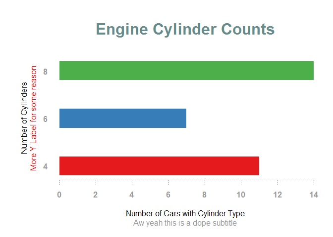
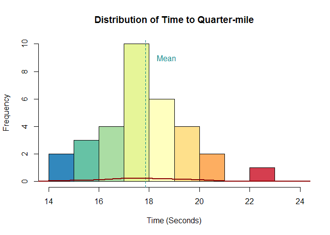
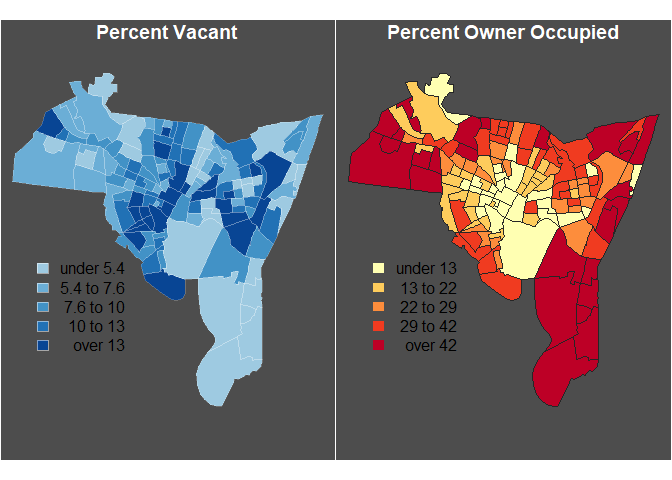

R-Plotting-and-Mapping-Tutorial
================
Mark Simpson
January 30, 2017

### Meta-introduction: February 5, 2018

This tutorial was originally created for the [Geospatial Data Science 2017 workshop](https://sites.psu.edu/gds2017/), which I co-organized along with Dr. Eun-Kyeong Kim, and which was held February 3rd-5th, 2017 on the Penn State campus. It was originally given as part of a live tutorial. I have slightly updated the formatting, but it is presented as-is.

Introduction
============

This tutorial is meant to give a very basic overview of plotting data and mapping for R. We will briefly get sense of basic R plotting using the default plotting functions. We'll also cover the basics such as how to import and make maps with point, line, and polygon data, and then make those maps not suck. This tutorial is not meant to be comprehensive (how can it be when a new package comes out every minute?), but is meant to get you started so can start building your own workflow.

The general outline is:

-   Basic Plots with Default R
-   Scratch Surface of ggplot
-   Mapping with GISTools
-   Using Real Data

Working with Color
==================

Color is fundamental to making usable, understandable, and beautiful visualizations, and is where we are going to start.

Before we can mess with color, we need some graphic, and to get a graphic, it'd be best to get some data. So, we will load in a built-in dataset within R called *mtcars* (car statistics, details [here](http://stat.ethz.ch/R-manual/R-devel/library/datasets/html/mtcars.html), and extract some values to then graph.

``` r
rm(list = ls()) # Clear environment

# Get some data to play with
data(mtcars) # Built-in dataset, motor trend car testing
head(mtcars) # First 5 rows
```

    ##                    mpg cyl disp  hp drat    wt  qsec vs am gear carb
    ## Mazda RX4         21.0   6  160 110 3.90 2.620 16.46  0  1    4    4
    ## Mazda RX4 Wag     21.0   6  160 110 3.90 2.875 17.02  0  1    4    4
    ## Datsun 710        22.8   4  108  93 3.85 2.320 18.61  1  1    4    1
    ## Hornet 4 Drive    21.4   6  258 110 3.08 3.215 19.44  1  0    3    1
    ## Hornet Sportabout 18.7   8  360 175 3.15 3.440 17.02  0  0    3    2
    ## Valiant           18.1   6  225 105 2.76 3.460 20.22  1  0    3    1

``` r
mtcars$mpg # Get a column
```

    ##  [1] 21.0 21.0 22.8 21.4 18.7 18.1 14.3 24.4 22.8 19.2 17.8 16.4 17.3 15.2
    ## [15] 10.4 10.4 14.7 32.4 30.4 33.9 21.5 15.5 15.2 13.3 19.2 27.3 26.0 30.4
    ## [29] 15.8 19.7 15.0 21.4

``` r
mpg <- mtcars$mpg[1:5] # Put first five values into new array
mpg # Check results
```

    ## [1] 21.0 21.0 22.8 21.4 18.7

``` r
mpg <- mtcars[1:5, 1] # Same as this
mpg # Check Results
```

    ## [1] 21.0 21.0 22.8 21.4 18.7

Now that we have a simple piece of data, it's easy to graph it. R's default *plot()* function will make an attempt to graph many types of datasets, but often more specialized functions are available.

``` r
plot(mpg) # R makes a guess with just plot()
```


*barplot()* is an example of a more specialized function. For our purposes in understanding color, let's just stick with it.

``` r
barplot(mpg) # More specific function
```


There are several different ways to specify color manually, but R also has a predefined list of colors that you can call by name. While you can look this up within R, the easiest way is to use an external reference, such as this [cheat sheet](http://research.stowers-institute.org/efg/R/Color/Chart/ColorChart.pdf).

``` r
# colors() # All named colors in R

head(colors()) # First five
```

    ## [1] "white"         "aliceblue"     "antiquewhite"  "antiquewhite1"
    ## [5] "antiquewhite2" "antiquewhite3"

``` r
colors()[599] # Specific color in list
```

    ## [1] "slategray"

We can then assign any of these colors to our graph, which can be done in multiple ways, such as by named color, rgb value, or even the hex value of the color.

``` r
barplot(mpg, col = "slategray") # Here is our slategray barplot
```


``` r
col2rgb("slategray")  # Yields RGB values
```

    ##       [,1]
    ## red    112
    ## green  128
    ## blue   144

Here are examples in RGB:

Values are between 0-1, here red is at max value, which is the reddest red you can red.

``` r
barplot(mpg, col = rgb(1, .0, .0))  
```


Here red is at half value, see the difference?

``` r
barplot(mpg, col = rgb(.5, .0, .0))  
```


Red with alpha channel set for 25% opacity:

``` r
barplot(mpg, col = rgb(.5, .0, .0, .25)) 
```


This has the range changed to 0-255, more common in graphics software like Photoshop.

``` r
barplot(mpg, col = rgb(255, 0, 0, max = 255)) 
```


RGB Hexcodes are somewhat more common (RGB on the 0-255 scale, as FF in hex equals 255 in decimal) :

``` r
barplot(mpg, col = "#FF0000")  # Note the values (FF, 00, 00)
```


Colors can also be stored within an array and used within other functions, which can be used for categorical variables. R also has several built-in color "palettes" that can be accessed.

``` r
barplot(mpg, col = c("red", "blue"))  # Colors will cycle
```


You can also store several colors in vector, like so:

``` r
red.blue <- c("red", "blue") # Vector so store color information

barplot(mpg, col = red.blue)
```


There are also several built-in color pallets available in R...

``` r
barplot(mpg, col = 1:6)
```


``` r
barplot(mpg, col = rainbow(6))
```


``` r
barplot(mpg, col = heat.colors(6))
```


``` r
barplot(mpg, col = terrain.colors(6))
```


``` r
barplot(mpg, col = topo.colors(6))
```


``` r
barplot(mpg, col = cm.colors(6))
```


While these built-in colors are useful, they are not necessarily pretty, easily printable, or color-blind friendly. Luckily, someone has already created a fantastic set up colors tailored to data visualization.

*RColorBrewer* is based off of the tool [Color Brewer](http://colorbrewer2.org/), created by Dr. Cindy Brewer, head of the PSU Department of Geography, and a classy lady. Originally conceived for maps, it is very useful for all kinds of data, as we shall see.

``` r
# install.packages("RColorBrewer")

library("RColorBrewer")

# List all palettes and attributes
# brewer.pal.info # Note the attributes

display.brewer.all() # Actually display those palettes
```


``` r
#Display only those that are colorblind friendly
display.brewer.all( colorblindFriendly = TRUE)
```


``` r
# Display a specific number of colors for a palettes

display.brewer.pal(7,"BrBG") # Display a sequence of seven colors from BrBG
```


``` r
display.brewer.pal(9,"PiYG") # Display a sequence of nine colors from PiYG
```


``` r
brewer.pal(7,"BrBG") # The actual function to use, note it returns Hex codes
```

    ## [1] "#8C510A" "#D8B365" "#F6E8C3" "#F5F5F5" "#C7EAE5" "#5AB4AC" "#01665E"

``` r
barplot(mpg, col = brewer.pal(5,"BrBG")) # BrBG applied to our barplot
```


``` r
barplot(mpg, col = brewer.pal(5,"Set2")) # Set2 applied to our barplot
```


---------------------------------------------------------------------------------------

Plotting (Statistical Graphs)
=============================

Okay, now let's get to some real plotting. First, how to get that bar chart into something sensible? First, we need to do a little data processing to get the appropriate information for a bar chart. Barplot works off of a *table*, which can be created using a function of the same name.

``` r
cyl.table <- table(mtcars$cyl) # Create a summary table of the cyl variable in mtcars

barplot(cyl.table) # Not fancy, but there are many, many other options...
```


One important thing to remember is that when you do not specify a parameter, you are often just using what is set as the default. For instance, the last line above is really passing this to R:

``` r
# ?barplot

barplot(cyl.table, width = 1, 
        space = NULL,
        names.arg = NULL, 
        legend.text = NULL, 
        beside = FALSE,
        horiz = FALSE, 
        density = NULL, 
        angle = 45,
        col = NULL, 
        border = par("fg"),
        main = NULL, 
        sub = NULL, 
        xlab = NULL, ylab = NULL,
        xlim = NULL, ylim = NULL, 
        xpd = TRUE, 
        log = "",
        axes = TRUE, 
        axisnames = TRUE,
        cex.axis = par("cex.axis"), 
        cex.names = par("cex.axis"),
        plot = TRUE, 
        axis.lty = 0, 
        offset = 0,
        add = FALSE, 
        args.legend = NULL)
```


This is why using the help (?) is so critical, because it will tell you what you can change. Let's experiment just a little bit with some of these options:

``` r
# Note that you can split functions across lines and comment specific parts separately
barplot(cyl.table, 
       # density = c(20, 5, -1), # Hatched fill, negative means no hatching
        space = 1.5, # Spaces between bars
        horiz = TRUE, # Flip them bars
        las = 1,  # Orientation of axis labels
        ylab = "Number of Cylinders",
        col = brewer.pal(3,"Set1"),
        border = NA,  # Remove border on bars
        main = "Engine Cylinder Counts",  # Title
        xlab = "Number of Cars with Cylinder Type")
```


"Par()
------

As you can see, our graph is neat, but our labels are a little too close to the edges. These and many options like these are contained not with individual plot functions, but within the plotting system itself, which can be set by using the *par()* (parameters) function. A good description of many of them can be found [at Quick-R](http://www.statmethods.net/advgraphs/parameters.html).

*par()* is great if you need to pump out a bunch of graphs since you only need to change them once. On the other hand, it can be slightly annoying because there is no built-in way to restore the default values, so it's best to store them in a variable.

``` r
# This will list the current settings ( commented because obnoxious)
#par()

o.par <- par(no.readonly = T) # Store current setting in new variable, but not read only ones

par(mar = c(6,6,6,2)) # Set new margins, (bottom, left, top, right)

# Plot the same thing, but notice the left axis label
barplot(cyl.table, 
        space = 1.5, # Spaces between bars
        horiz = TRUE, # Flip them bars
        las = 1,  # Orientation of axis labels
        ylab = "Number of Cylinders",
        col = brewer.pal(3,"Set1"),
        border = NA,  # Remove border on bars
        main = "Engine Cylinder Counts",  # Title
        xlab = "Number of Cars with Cylinder Type")
```

 Here par sets axis fonts to gray60, and bolds text.

``` r
par(col.axis="gray60", font.axis = 2) 

barplot(cyl.table, 
        space = 1.5, # Spaces between bars
        horiz = TRUE, # Flip them bars
        las = 1,  # Orientation of axis labels
        ylab = "Number of Cylinders",
        col = brewer.pal(3,"Set1"),
        border = NA,  # Remove border on bars
        main = "Engine Cylinder Counts",  # Title
        xlab = "Number of Cars with Cylinder Type")
```


``` r
par(o.par) # Restore defaults
```

Helper Functions
----------------

However, not everything is contained within *par()*, and if you need to get even more particular, there are specialized functions for different graph elements. For example, the color of the tick marks themselves. To change these, we can construct a custom axis using the *axis()* function, which operates on a pre-constructed plot, ideally one without axes, which we can do by suppressing those options. Similarly, we can not specify a title and create one with the *title()* function.

Other examples include adding text annotations, adding reference lines (such as a global average), and a legend which explains visual attributes like colors (important for maps). [More information can be found here](http://www.statmethods.net/advgraphs/axes.html).

But for now, title and axis:

``` r
par(mar = c(6,6,6,2), col.axis="gray60", font.axis = 2) # All the stuff we did before

#Let's make a plot without an axis at the bottom or a title.
barplot(cyl.table,
        xaxt ="n", # Supress x axis. yaxt for y, axes = FALSE does both
        space = 1.5, # Spaces between bars
        las = 1,
        horiz = TRUE, # Flip them bars
        ylab = "Number of Cylinders",
        col = brewer.pal(3,"Set1"),
        border = NA,  # Remove border on bars
        xlab = "Number of Cars with Cylinder Type")

# 1=bottom, 2=left, 3=top, 4=right
axis(1, col = "gray50", lty = 3) # 1 indicates position, lty is line type

title(main ="Engine Cylinder Counts", 
      col.main = "paleturquoise4", # Set color of main title 
      cex.main = 2, # Set relative size of title
      sub = "Aw yeah this is a dope subtitle", # Subtitle
      col.sub = "gray60")

# Title also contains options for axis labels
title(ylab = "More Y Label for some reason", 
      line = 2, # Change position in terms of text lines
      col.lab = "red")
```



``` r
par(o.par) # Rest par() to original
```

Histograms
----------

Histograms are similar in looks to barplots, and often more useful. Here we will also add a line representing the mean along with a label, and a line representing density.

``` r
hist(mtcars$qsec,
     main="Distribution of Time to Quarter-mile",
     xlab="Time (Seconds)", 
     xlim = c(14,24), # Force x axis limits 
     col= rev(brewer.pal(9, "Spectral")) ) # Same number of colors; really chartjunk

abline(v = mean(mtcars$qsec), lty = 2, col = "turquoise4") # Create a line at average qsec

text(18.7, 9, labels ="Mean", col = "turquoise4") # Create a text label at specific x, y

lines(density(mtcars$qsec), col = "darkred", lwd = 2) # Kernel density line
```



We can also alter the amount of breaks:

``` r
hist(mtcars$qsec,
     breaks = 5, # Set number of breaks
     main="Distribution of Time to Quarter-mile",
     xlab="Time (Seconds)", 
     col= "gray80" )

abline(v=mean(mtcars$qsec), lty = 2, col = "turquoise4") # Create a line at average qsec

text(18.7, 12, labels ="Mean", col = "turquoise4") # Note the different x, y

lines(density(mtcars$qsec), col = "darkred", lwd = 2) # Kernel density line
```


### Boxplots

Boxplots are THE statistical graphs. So let's make some. We can make a boxplot for that qsec (time to a quarter mile) variable...

``` r
boxplot(mtcars$qsec, ylab = "Time to Quarter Mile") # All cars qsex
```


...but what would be more interesting is to see it between cars with different cylinder engines. Well, sort of interesting in that it should be pretty obvious.

We can also use *legend* to give the same information as the bottom axis, but in a slightly different way.

``` r
four.qsec <- mtcars$qsec[mtcars$cyl == 4] # qsec for rows where cyl = 4 
six.qsec <- mtcars$qsec[mtcars$cyl == 6] # qsec for rows where cyl = 6 
eight.qsec <- mtcars$qsec[mtcars$cyl == 8] # qsec for rows where cyl = 8 
eight.qsec # Check results
```

    ##  [1] 17.02 15.84 17.40 17.60 18.00 17.98 17.82 17.42 16.87 17.30 15.41
    ## [12] 17.05 14.50 14.60

``` r
boxplot(four.qsec, six.qsec, eight.qsec) # Wow! Graphs! but not labelled, and not pretty.
```


Now, to make it pretty:

``` r
boxplot(four.qsec, six.qsec, eight.qsec, # Data
        ylim = c(14,24), # Set Y axis limits manually
        xaxt = "n",
       # names = c("Four","Six", "Eight"), # Need to provide names since our var are simple arrays
        col = brewer.pal(3, "Set2"),   # Tasteful colors for boxes
        boxwex = 0.5,  # Width of box (as proportion of original)
        whisklty = 1,  # Whisker line type; 1 = solid line
        staplelty = 0,  # Staple (line at end) type, 0 is none
        outpch = 16,  # Symbols for outliers
        outcol =  brewer.pal(3, "Set2"), # Colors for outliers
        main = "Quarter Mile Time and Engine Type",
        col.main = "gray40", # Color of title
        ylab = "Time in Seconds",
        frame.plot = FALSE # Take away the whole frame
        )

# Create a legend
legend("topright", # Location (can also be x, y)
       legend = c("Four","Six", "Eight"), # Labels
       fill = brewer.pal(3, "Set2"), # Same colors as above
       bty = "n", # Remove box around legend
       title = "Number of Cylinders",
       title.col = "gray40",
       text.font = 3, # Italic
       cex = 1.2) # Make a little bigger

abline(h = mean(mtcars$qsec), lty = 2, col = "gray50") # Line for global mean
```


Scatterplot
-----------

Okay, now let's work with the simple scatter plot. The trick is altering the point symbols, which have totally different parameters attached.

Simple example, two variables in same table:

``` r
plot(mtcars$hp, mtcars$mpg) 
```


Points symbol types can be changed with *pch* options:

``` r
plot(mtcars$hp, mtcars$mpg, pch = 18) # Diamond points
```


You can also use these disgusting things (*pch = 13*). What are they?

``` r
plot(mtcars$hp, mtcars$mpg, pch = 13) 
```


Yeah, so that's not that exciting, but there's a lot we can add for it to be more interesting. For one, it would be cool to see which dots correspond to which type of engine. To do that, however, we need to do a little bit of wrangling to create a new field that is a factor, which we can then use as our categorical engine variable.

``` r
mtcars$cyl.2 <- as.factor(mtcars$cyl) # Create a new field so we can use unclass()
mtcars$cyl.2 # Check results, note it has "levels"
```

    ##  [1] 6 6 4 6 8 6 8 4 4 6 6 8 8 8 8 8 8 4 4 4 4 8 8 8 8 4 4 4 8 6 8 4
    ## Levels: 4 6 8

``` r
plot(mtcars$hp, mtcars$mpg,
     pch= c(15, 16, 17)[unclass(mtcars$cyl.2)], # Change type of point
     col = c("#00008B96", "#00640096", "#8B000096")[unclass(mtcars$cyl.2)], #Semi-transparent colors, assigned per cyl.2 type
     main ="Horsepower versus Fuel Efficiency",
     col.main = "steelblue",
     cex.main = 1.5, # Increase size
     xlab = "Horsepower", # x label
     ylab = "Miles per Gallon", # y label 
     font.lab = 2 # make bold
     ) 

legend("topright", # Location (can also be x, y)
       legend = c("Four","Six", "Eight"), # Labels
       col = c("#00008B96", "#00640096", "#8B000096"), # Same colors as above
       pch = c(15, 16, 17),
       bty = "n", # Remove box around legend
       title = "Number of Cylinders",
       title.col = "gray40",
       cex = 1) # Make a little bigger
```


(Not very good) Lines
---------------------

Line charts are slightly involved in R for some reason, since you effectively have to create a graph, then add lines for each variable. This example is pretty notional since this data doesn't really contain anything that makes particular sense to use a line graph for, like change over time.

``` r
plot(six.qsec, 
     type ="o", # Type can specify particular types of graph to force
     col = "blue", 
     pch = 18, # Set symbol to diamond
     main = "Speed... over Index?"
      )

# Add second line
lines(eight.qsec, 
      type = "o", 
      col = "red", 
      pch = 19,
      lty =4)

# Add legenve
legend("topright", 
       legend = c("Six Cylinder", "Eight Cylinder"), 
       col = c("blue", "red"), 
       lty =c(1, 4) # Need to specify line type in order to force lines
       )
```


Scatterplot matrices I'll cover quickly, but they can be useful for looked at a lot of data at once. However, often they are impenetrable for anyone not immersed in your data already.

``` r
pairs(mtcars[c(1,4,7)], 
       col.axis = "blue",
       fg ="blue",
       pch = c(15, 16, 17)[unclass(mtcars$cyl.2)], 
       col = c("#00008B96", "#00640096", "#8B000096")[unclass(mtcars$cyl.2)]
       )
```


Multiple Plotting with mfrow()
------------------------------

As a bonus, you can place multiple graphs in the same plot by changing the mfrow option in *par()*

``` r
par(mfrow=c(1,2))

boxplot(mtcars$qsec, # All cars qsex
        boxwex = 0.5,  # Width of box (as proportion of original)
        whisklty = 1,  # Whisker line type; 1 = solid line
        staplelty = 0,  # Staple (line at end) type, 0 is none
        outpch = 16,  # Symbols for outliers
        col = "slategray",
        outcol =  "slategray", # Colors for outliers
        ylab = "Time to Quarter Mile", 
        main = "Quarter Mile Time and Engine Type",
        col.main = "steelblue", # Color of title
        frame.plot = FALSE # Take away the whole frame
        )

plot(mtcars$hp, mtcars$mpg,
     pch= 19, # Change type of point
     col = c("#00008B96", "#00640096", "#8B000096")[unclass(mtcars$cyl.2)], #Semi-transparent colors, assigned per cyl.2 type
     main ="Horsepower versus Fuel Efficiency",
     col.main = "steelblue",
     cex.main = 1.5, # Increase size
     xlab = "Horsepower", # x label
     ylab = "Miles per Gallon", # y label 
     font.lab = 2 # make bold
     ) 
```


``` r
par(o.par) # Reset par
```

Exporting in Brief
------------------

You can save plots through R studio, but you can also write code to do it, which is useful when you have multiple plots to generate. There are several different filetypes available, and the directory can be specified more directly, but the principle is that you call the specif function, create the plot, and then use *dev.off()* to stop 'plotting' and actually export the file.

For the markdown I've disabled the code, but it would look like this:

``` r
png(filename= "Neat.png")  # "Open device""

plot(mtcars$hp, mtcars$mpg,
     pch= 19, # Change type of point
     col = c("#00008B96", "#00640096", "#8B000096")[unclass(mtcars$cyl.2)], #Semi-transp. colors, assigned per cyl.2 type
     main ="Horsepower versus Fuel Efficiency",
     col.main = "steelblue",
     cex.main = 1.5, # Increase size
     xlab = "Horsepower", # x label
     ylab = "Miles per Gallon", # y label 
     font.lab = 2 # make bold
     ) 

dev.off()  # Close "device" (end writing)
```

Scratching Surface of ggplot
============================

Okay let's take a brief dip into *ggplot*, which is widely used as it offers some advantages over R's default plotting in terms of customization. The downside is that it takes a fairly different approach to actually creating graphs which is much more layer-based, which can be somewhat mind-bending. Today we're going to start by recreating some of the graphs we have completed above using the *qplot()* (quick plot) function, based off those found [here](http://www.statmethods.net/advgraphs/ggplot2.html).

``` r
rm(mpg) # Remove object since it has conflicting name

# install.packages("ggplot2")
library(ggplot2)

# Quickest plot
qplot(mpg, data = mtcars) # Assumes histogram, note tip in console
```

    ## `stat_bin()` using `bins = 30`. Pick better value with `binwidth`.

 This can get real fancy, real fast:

``` r
qplot(mpg, # This is our variable (Column)
      data = mtcars, # This is our dataset
      geom = "histogram", # Type of geometry (type of plot)
      binwidth = 5, # Number of bins
      fill = cyl.2, # Variable setting fill, categorical
      alpha = I(.5), # Alpha transparency
      main = "Distribution of Time to Quarter-mile", 
      xlab = "Time (seconds)", 
      ylab = "Density"
      )
```

 Boxplot:

``` r
qplot(cyl.2, qsec, # Set x and y.
      data = mtcars, # Our dataframe, so x and why can reference
      geom = c("boxplot"), 
      fill = cyl.2, # Since this is a factor, it assumes categorical
      main = "Speed and Cylinders",
      xlab = "", # Empty
      ylab = "Time to Quarter Mile (sec)"
      )
```


It's interesting to compare these to the plots we made above. Let's take a look at our scatterplot, and then what *qqplot* spits out.

``` r
############# Scatterplot repeated from above
plot(mtcars$hp, mtcars$mpg,
     pch= 19, # Change type of point
     col = c("#00008B96", "#00640096", "#8B000096")[unclass(mtcars$cyl.2)], #Semi-transparent colors, assigned per cyl.2 type
     main ="Horsepower versus Fuel Efficiency",
     col.main = "steelblue",
     cex.main = 1.5, # Increase size
     xlab = "Horsepower", # x label
     ylab = "Miles per Gallon", # y label 
     font.lab = 2 # make bold
     ) 

legend("topright", # Location (can also be x, y)
       legend = c("Four","Six", "Eight"), # Labels
       col = c("#00008B96", "#00640096", "#8B000096"), # Same colors as above
       pch = 19,
       bty = "n", # Remove box around legend
       title = "Number of Cylinders",
       title.col = "gray40",
       cex = 1) # Make a little bigger
```


``` r
#############

# qqplot Scatterplot
qplot(hp, mpg, 
      data = mtcars, 
      shape = cyl.2, # Varies with categorical variable (factor)
      color = cyl.2, # Varies with categorical variable (factor)
      size=I(3), # I is relative to default (so *3 here)
      main ="Horsepower versus Fuel Efficiency",
      xlab="Horsepower", 
      ylab="Miles per Gallon"
      ) 
```


*qqplot* is fast, but it is not very flexible. For example, on the histogram, you cannot alter the fill or add an outline to the bars. This brings us to just touch ong the real power of ggplot. We don't have much to spend on this unfortunately, there are numerous references that can help you get started, such as this amazing [cheat sheet](https://www.rstudio.com/wp-content/uploads/2015/03/ggplot2-cheatsheet.pdf)

By far the most important thing to notice is that ggplot constructs plots using multiple functions as a matter of course, and that the initial function often does nothing but define the plot area, with subsequent functions adding on the actual representations (lines, bars, colors, etc.)

So we create a canvas based off our data, then "add" the histogram:

``` r
ggplot(NULL, aes(x = mtcars$qsec)) +
  geom_histogram() # Create the graphic (with data from above)
```

    ## `stat_bin()` using `bins = 30`. Pick better value with `binwidth`.


Here's what it looks like with some aesthetic modifications, and the addition of a density plot.

``` r
ggplot(NULL, aes(x = mtcars$qsec)) + 
  geom_histogram(fill = "white", color = "black") + # Simple aesthetics
  geom_density(color = "blue")
```

    ## `stat_bin()` using `bins = 30`. Pick better value with `binwidth`.


Scatterplot:

``` r
ggplot(mtcars, aes(x = hp, y = mpg, # x and y
                   shape = cyl.2, # Change shape according to cyl.2
                   color = cyl.2)) + # Change color according to cyl.2
  geom_point(size = 3) + # Create points
  geom_rug () + # Rug plot
  geom_smooth(alpha = .2) # regressiony
```

    ## `geom_smooth()` using method = 'loess'


Boxplot equivalent to the one above:

``` r
ggplot(mtcars, aes( x = cyl.2, y = qsec)) + 
  geom_boxplot(aes(fill = cyl.2)) + # Create boxplot, fill by cyl.2
  ylab("Time to Quarter Mile (sec)")+
  xlab("")+
  scale_fill_discrete(name = "Cylinders") + # Legend label
  ggtitle("Speed and Cylinders")
```


---------------------------------------------------------------------------------------

Mapping
=======

Okay, now onto mapping things. There are several packages available that will allow you to map spatial data in R with varying degrees of ease and customization, but this

Basic mapping
-------------

These are decent ways to get reasonable maps of an area quickly, but what about actually working with spatial data to make maps from scratch? This is unsurprisingly much more involved, but much of the plotting is not fundamentally different than what we've been dealing with already.

There are many different options for mapping, but we're going to focus on *GIStools*, which depends on several packages, including *maptools*, *rgdal*, and *sp*.

This section is largely based on sections from the book [An Introduction to R for Spatial Analysis and Mapping](https://www.amazon.com/Introduction-Spatial-Analysis-Mapping/dp/1446272958), by Chris Brundson and Lex Comber. Chris Brundson is one of the authors of the GIStools package.

``` r
rm(list= ls()) # Clear environment

# install.packages("GISTools")
# library(GISTools) # Note all the dependent packages loaded

library(GISTools, suppressPackageStartupMessages("True")) # Lead package without oodles of messages
```

    ## Loading required package: maptools

    ## Loading required package: sp

    ## Checking rgeos availability: TRUE

    ## Loading required package: MASS

    ## Loading required package: rgeos

    ## rgeos version: 0.3-25, (SVN revision 555)
    ##  GEOS runtime version: 3.6.1-CAPI-1.10.1 r0 
    ##  Linking to sp version: 1.2-5 
    ##  Polygon checking: TRUE

``` r
data(newhaven) # Convenient collection of data
```

Plotting once these packages (*sp* in particular) are loaded is pretty straightforward; R now knows how to deal with these data types.

``` r
plot(breach) # Points
```


``` r
plot(roads) # Lines
```


``` r
plot(blocks) # Polygons
```


``` r
class(breach) # SpatialPoints
```

    ## [1] "SpatialPoints"
    ## attr(,"package")
    ## [1] "sp"

``` r
class(roads) # SpatialLinesDataFrame
```

    ## [1] "SpatialLinesDataFrame"
    ## attr(,"package")
    ## [1] "sp"

``` r
class(blocks) # SpatialPolygonsDataFrame
```

    ## [1] "SpatialPolygonsDataFrame"
    ## attr(,"package")
    ## [1] "sp"

``` r
# head(blocks) # This is a MESS
# head(data.frame(blocks)) # Coerce to dataframe first
```

The major difference in plotting map elements with *plot()* is that **add = TRUE** is much more common. The idea of layers isn't exactly new for GISers (pronounce as "Jizzers" to annoy them), but might take some getting used to for others. Let's make a quick crime map using [R colors](http://research.stowers-institute.org/efg/R/Color/Chart/ColorChart.pdf).

``` r
# Plot the 'lowest' first.
plot(blocks, 
     lwd = 0.5, 
     col = "darkseagreen1", 
     border = "white") 

# Roads on top
plot(roads, 
     add = TRUE, 
     col = "slategray3") 

# Add points
plot(breach, 
     pch = 17, 
     add = TRUE, 
     col =add.alpha("#EE2C2C", .7)) # Add transparency
```


The *Locator* function lets you interact directly with the plot. You click within the plot, and it returns the coordinates of where you clicked. This is a reasonable way to get the coordinates when you are placing things like legends within the plot

To use it, you run the command, then you select points within the plot (however many you want), and then hit ESC. It will return the coordinates to the console, which you can then use to create a polygon.

``` r
# locator() # Get Coordinates in R studio (commented for markdown)

plot(blocks, 
     lwd = 0.5, 
     col = "cornsilk", 
     border = "antiquewhite2")

plot(roads, 
     add = TRUE, 
     col = "slategray3") 

plot(breach, 
     pch = 20, 
     add = TRUE, 
     col ="red")

# Add a scale bar, if you're into that
map.scale(xc = 540000, yc = 152000, # Position on map, in map units
          len = miles2ft(2), # Length in feet (2 * 5,280)
          units = "Miles", 
          ndivs = 4, 
          subdiv = 0.5)

# ?map.scale # Plots scale bar on top of map
# ?miles2ft # Unit conversion function, one of many
#locator() # Click once on location, then hit finish button in plot window OR use the Esc key

# North arrow
north.arrow(xb = 540000, yb = 157000, 
            len = miles2ft(.2), # Length of base
            col = "gray60",
            border = "gray30",
            tcol = "gray60") # Color

title(main = 'New Haven, CT.') # Title

title(main = "Crime Infested Wasteland", # Informative subtitle
      line = -.2, # Move down
      col.main = "red3",
      font.main = 4, # Bold italic
      cex.main = 1) # make a little smaller
```


Choropleth Maps
===============

Okay, this is essentially a basic reference map, but we can also use the attribute data within the spatial classes to make thematic maps, such as choropleth maps. There are many ways to create choropleth maps, including a whole friggin' package called *choroplethr*, but let's use *GISTools* for consistency, which has some functions specifically for that. Let's make two maps with the data we have: percent vacant and percent owner occupied.

``` r
# head(data.frame(blocks)) # Look at our data again

colnames(data.frame(blocks)) # Just the attribute names
```

    ##  [1] "NEWH075H_"  "NEWH075H_I" "HSE_UNITS"  "OCCUPIED"   "VACANT"    
    ##  [6] "P_VACANT"   "P_OWNEROCC" "P_RENTROCC" "NEWH075P_"  "NEWH075P_I"
    ## [11] "POP1990"    "P_MALES"    "P_FEMALES"  "P_WHITE"    "P_BLACK"   
    ## [16] "P_AMERI_ES" "P_ASIAN_PI" "P_OTHER"    "P_UNDER5"   "P_5_13"    
    ## [21] "P_14_17"    "P_18_24"    "P_25_34"    "P_35_44"    "P_45_54"   
    ## [26] "P_55_64"    "P_65_74"    "P_75_UP"

``` r
blocks$P_VACANT[1:5] # Can be treated like a dataframe... sometimes  
```

    ## [1]  4.980341  5.882353  6.940874  7.459207 13.092551

``` r
# hist(blocks$P_VACANT) #Same for graphing
display.brewer.pal(5, "Blues")
```


``` r
# auto.shading builds off of color brewer to create classes
# Needs to be stored separately
shades.blue  <-  auto.shading(blocks$P_VACANT, cols = brewer.pal(7,'Blues')[3:7]) #Create a new color palette

shades.blue # Note class breaks
```

    ## $breaks
    ##  20%  40%  60%  80% 
    ##  5.4  7.6 10.0 13.0 
    ## 
    ## $cols
    ## [1] "#9ECAE1" "#6BAED6" "#4292C6" "#2171B5" "#084594"
    ## 
    ## attr(,"class")
    ## [1] "shading"

``` r
# ?auto.shading # Part of GIStools

choropleth(blocks, 
           v = blocks$P_VACANT, # Variable to be mapped
           shading = shades.blue, # Shading object created above
           bg = "gray30", # Background color
           border = NA # No Border
           ) 

plot(blocks,
     add = TRUE,
     col=NA, 
     border = add.alpha("#FFFFFF", .2) # partly transparent white
     )

# choropleth maps attributes held in SpatialPolygons DataFrame (e.g., 'blocks')
choro.legend(px = 533000, py = 167000, 
             sh = shades.blue,
             border = "#FFFFFF80", # Semitransparent white around boxes
             bg = NA, # No background color,
             bty = "n", # No outer box
             text.col = "red", # Broken apparently
             title.col = "white"
             )

title(main = "Percent Vacant",
      col.main = "gray20")
```


Let's create new set of shades for Owner occupied percentage:

``` r
shades.yell  <-  auto.shading(blocks$P_OWNEROCC,cols=brewer.pal(5,'YlOrRd')) #Create a new color palette

choropleth(blocks, blocks$P_OWNEROCC, 
           shading = shades.yell, # Shading object created above
           bg = "gray30", # Background color
           border = NA # No Border
           ) 
           
plot(blocks,
     add = TRUE,
     col=NA, 
     border = add.alpha("#000000", .15) # partly transparent black
     )

choro.legend(px = 533000, py = 167000, 
             sh = shades.yell,
             border = NA,
             bg = NA, # No background color,
             bty = "n" # No outer box
             )
# Add title
title(main = "Percent Owner Occupied",
      col.main = "gray20")
```


Now, what would be even more interesting to put these side by side. Note that color choice is important, so these would probably work better with swapped palettes, since red is usually associated with 'negative' variables.

``` r
o.par <- par(no.readonly = FALSE)

# Put them side by side, adjust margins
par(mfrow = c (1,2), mar = c(1,0,1,0)) # mar =bottom, left, top, right

# Vacant Map
choropleth(blocks, 
           v = blocks$P_VACANT, 
           shading = shades.blue, 
           bg = "gray30", 
           border = NA) 

plot(blocks, 
     add = TRUE, 
     col = NA, 
     border = add.alpha("#FFFFFF", .2))

choro.legend(px = 533000, py = 167000, 
             sh = shades.blue, 
             border = "#FFFFFF80", 
             bg = NA, bty = "n", 
             text.col = "red", 
             title.col = "white")

title(main = "Percent Vacant", 
      col.main = "white", 
      line = -1)

# Second map, owner-occupied

choropleth(blocks, 
           blocks$P_OWNEROCC, 
           shading = shades.yell, 
           bg = "gray30", 
           border = NA) 

plot(blocks, 
     add = TRUE, 
     col=NA, 
     border = "gray15" ) # Alpha not working on second plot??

choro.legend(px = 533000, py = 167000, 
             sh = shades.yell, 
             border = NA, 
             bg = NA, 
             bty = "n" )

title(main = "Percent Owner Occupied", 
      col.main = "white", 
      line = -1)
```



``` r
par(o.par)
```

Raster in a Minute
==================

Okay, let's very very briefly delve into the world of rasters. A type of raster can be created using just input points called a kernel density raster, which can be used to visualize relationships, but is prone to manipulation and can become misleading very quickly.

``` r
head(breach) # Note: no underlying data
```

    ## SpatialPoints:
    ##          Long      Lat
    ## [1,] 551419.5 181266.3
    ## [2,] 556319.5 177580.7
    ## [3,] 551423.1 172304.5
    ## [4,] 550261.9 182613.2
    ## [5,] 555168.5 172163.4
    ## [6,] 549133.6 169623.6
    ## Coordinate Reference System (CRS) arguments: +proj=lcc
    ## +datum=NAD27 +lon_0=-72d45 +lat_1=41d52 +lat_2=41d12 +lat_0=40d50
    ## +x_0=182880.3657607315 +y_0=0 +units=us-ft +no_defs +ellps=clrk66
    ## +nadgrids=@conus,@alaska,@ntv2_0.gsb,@ntv1_can.dat

``` r
breach.dens  <-  kde.points(breach, lims = tracts) # Create kernel density values, to then convert to raster

class(breach.dens) # SpatialPixelDataFrame
```

    ## [1] "SpatialPixelsDataFrame"
    ## attr(,"package")
    ## [1] "sp"

``` r
head(data.frame(breach.dens)) # Note the kde values added
```

    ##            kde     Var1   Var2
    ## 1 6.538740e-35 531731.9 147854
    ## 2 9.770069e-35 531922.3 147854
    ## 3 1.448876e-34 532112.7 147854
    ## 4 2.132528e-34 532303.2 147854
    ## 5 3.115218e-34 532493.6 147854
    ## 6 4.516606e-34 532684.0 147854

Then we need to convert to a different format for plotting.

``` r
breach.dense.grid <- as(breach.dens, "SpatialGridDataFrame") # Use 'as' to coerce into SpatialGridDataFrame (raster)

#head(data.frame(breach.dense.grid)) # same as above

image(breach.dense.grid, #Note the image() function for plotting
     col = colorRampPalette(brewer.pal(9, "Reds"))(100)
     )
```

 So this is a raster "heatmap" of where breaches of the peace happen, but it doesn't have any context.

It would be nice if we could have a strong outline for the city, with lighter internal divisions, and not show anything outside the city. So, uh, let's do that. First, we need to create a masking polygon, then create an outline polygon, and then add the blocks, but with transparency.

``` r
#repeated for R markdown
image(breach.dense.grid, #Note the image() function for plotting
     col = colorRampPalette(brewer.pal(9, "Reds"))(100)
     )

# Making an outline via the Union function
blocks.outline <- gUnaryUnion(blocks, id = NULL)

# This produces a warning; but they have the same proj4string?
masker <- poly.outer(breach.dense.grid, blocks.outline) # Create mask for raster

plot(masker, 
     border = "white",
     col = "white",
     add = TRUE)

#Plot the block outlines, but mostly transparent
plot(blocks, add = TRUE, 
     border = "#00000046") # Overlay boundaries for context

# Plot a black outline
plot(blocks.outline,
     border = "black", 
     lwd = 2, # Make thicker; line weight 2
     add = TRUE)

title(main = "Breaches of the Peace Heatmap")
```


---------------------------------------------------------------------------------------

Importing Shapefiles
====================

Here we will import a shapefile with attribute data using *rgdal*, subset it to the area we want using attributes and a clipping polygon (with the *GISTools* package), and make a couple simple maps.

Available spatial data often comes in the nearly-universal shapefile format (.shp), but R by default isn't able to process shapefiles.

As with everything else, you need the right package. There are several options, including *rgdal*, *maptools*, and *PBSmapping* (more information [here](https://www.nceas.ucsb.edu/scicomp/usecases/ReadWriteESRIShapeFiles))

While most of this tutorial relies on *GISTools*, which itself depends on several other spatial packages including *maptools*, *rgdal* is probably the most straightforward way as it automagically gets the projection information if provided in the shapefile.

The shapefile we will be using is from the [US Census](https://www.census.gov/geo/maps-data/data/tiger.html), and contains a significant amount of demographic attributes. Our particular data (Demographic Profile 1 of states) is hosted [here](http://www2.census.gov/geo/tiger/TIGER2010DP1/State_2010Census_DP1.zip).

First, some setup:

``` r
# install.packages("rgdal") # Uncomment and install if needed

# Probably already loaded through GISTools
# library(rgdal) 
suppressPackageStartupMessages(library(rgdal))

rm(list=ls()) # Clear workspace

# setwd() # Set working directory (or Session -> Set Working Directory -> To Source File Location)
```

Now to actually use *readOGR*

``` r
# ?readOGR

# Note that this is one file level down, in State_Census_DP1, and that no file exension is used
murica <- readOGR(dsn = "./State_2010Census_DP1", layer = "State_2010Census_DP1")
```

    ## OGR data source with driver: ESRI Shapefile 
    ## Source: "./State_2010Census_DP1", layer: "State_2010Census_DP1"
    ## with 52 features
    ## It has 195 fields

Of course, once it's in there, it's useful to take a look at it in a couple different ways. First:

``` r
class(murica) # What is this thing?
```

    ## [1] "SpatialPolygonsDataFrame"
    ## attr(,"package")
    ## [1] "sp"

Note that the type of data is *SpatialPolygonsDataFrame*, which means there is geometry (SpatialPolgyons), and attributes (DataFrame). This is important since these can be manipulated separately. For example, you can treat it like a regular data frame.

Note that some basic functions fail due to the data structure:

``` r
colnames(murica) 
```

    ## NULL

You need to access the right "slot" with @, in this case "data":

``` r
colnames(murica@data)[1:8] # 
```

    ## [1] "GEOID10"    "STUSPS10"   "NAME10"     "ALAND10"    "AWATER10"  
    ## [6] "INTPTLAT10" "INTPTLON10" "DP0010001"

``` r
slotNames(murica)
```

    ## [1] "data"        "polygons"    "plotOrder"   "bbox"        "proj4string"

But it can be treated like a dataframe in some ways:

``` r
murica$NAME10[1:5] # But can be treated like a dataframe for some purposes
```

    ## [1] Wyoming      Pennsylvania Ohio         New Mexico   Maryland    
    ## 52 Levels: Alabama Alaska Arizona Arkansas California ... Wyoming

``` r
# str(murica) # Verbose but gives you detailed information on structure of dataset

murica$NAME10[4] # Name of the fourth, best state
```

    ## [1] New Mexico
    ## 52 Levels: Alabama Alaska Arizona Arkansas California ... Wyoming

One important attribute that you'll probably have to deal with is the projection information:

``` r
murica@proj4string # This is the projection information, useful for later. Note "@"
```

    ## CRS arguments:
    ##  +proj=longlat +datum=NAD83 +no_defs +ellps=GRS80 +towgs84=0,0,0

``` r
proj4string(murica) # Same as above
```

    ## [1] "+proj=longlat +datum=NAD83 +no_defs +ellps=GRS80 +towgs84=0,0,0"

That's great, but how about plotting it?

``` r
# Wow, look at that extent!
plot(murica) 
```


Playing with the visuals:

``` r
# Playing with the visuals
plot(murica, col = "SlateBlue", border = NA) 
```


---------------------------------------------------------------------------------------

Subsetting and Clipping Data
============================

Obviously, this is a little awkward to map (thanks Aleutian islands), but we can go ahead and clip out the continental US for a more convenient mapping set. This is a common workflow, since often you are dealing with an area of interest (AOI) that does not align with all of your data. There are two ways to get the continental US: spatially, and by attribute. First, we will use the attributes to subset the desired states. Second, we will use a spatial clip and then we will subset using attributes in the data.

Subsetting using Attributes
---------------------------

Subsetting by attribute is much easier than a spatial clip, so let's start with that. We can create an array of booleans that we can use to subset the SpatialPolygonsDataFrame based off the name of the states and territories we don't want. These are Alaska, Hawaii, and Puerto Rico.

Note the use of logical operators (tips [here](http://www.statmethods.net/management/operators.html)). Review just in case: Here, **!=** is "is not", and **&** is "and", so this reads more or less *"is this state name not Alaska, not Hawaii, and not Puerto Rico?"*

``` r
real.index <- murica$NAME10 != "Alaska" & murica$NAME10 != "Hawaii" & murica$NAME10 != "Puerto Rico" # Create bool list of "real" states

head(real.index) # Note the FALSE instances for those states/territories
```

    ## [1] TRUE TRUE TRUE TRUE TRUE TRUE

``` r
murica.spdf <- murica[real.index,] # Subset using real.index

plot(murica.spdf) # Plot it!
```


We can also make it look a little better while we're at it:

``` r
# Fancy map of fanciness
plot(murica.spdf, 
     bg= "gray40", 
     col = "gray60", 
     border = "white") 
```


See? Not that hard. Now for spatial clipping...

Subsetting by Spatial Clip
--------------------------

This method is very much more involved, but necessary for true spatial subsetting, where geometry (i.e., polygons) are required, like clipping national data to a state boundary.

The first step in a spatial clip is getting a clipping polygon, which we will define manually here, but often this another existing area such as a administrative boundary.

Creating a spatial polygon takes a few steps...

``` r
xx <- as.vector(c(-125.85075, -129.45032, -57.45885, -58.35875)) # Coordinates of corners, x
yy <- as.vector(c(23.44079, 52.25642, 51.61607, 22.80044)) # Coordinates of corners, y

crds  <-  cbind(xx, yy) # Combine x and y to make x, y table
crds # Check...
```

    ##              xx       yy
    ## [1,] -125.85075 23.44079
    ## [2,] -129.45032 52.25642
    ## [3,]  -57.45885 51.61607
    ## [4,]  -58.35875 22.80044

``` r
# ?Polygon

Pl  <-  Polygon(crds) # Create a polygon (but not a *spatial* polygon!)

ID <- "clip" # This string will be used later to extract names when we re-merge data

Pls  <- Polygons(list(Pl), ID = ID) # Needs to be a list

#Convert Polygons to SpatialPolygons
# ?SpatialPolygons
clip.raw <- SpatialPolygons(list(Pls), proj4string = CRS(proj4string(murica)) ) # Note use of proj4string()

#Let's take a look

plot(murica) 

plot(clip.raw, 
     add = TRUE, 
     border= "red", 
     lwd = 2) #overlay (add) clipping polygon, red and line weight 2
```

 Clipping strips SpatialPolygonDataFrames of their attributes, which means you need a mechanism to restore those attributes. Long story short, but you can maintain the IDs of the features, and use those to re-join the dataframe back to the SpatialPolygon. This is easier if the clipping feature is also a SpatialPolygonDataFrame.

``` r
temp.df <- data.frame(value = 1, row.names = ID) # Create simple DF to add to SpatialPolgyon

clip.spdf <- SpatialPolygonsDataFrame(clip.raw, temp.df) # Merge the SpatialPolygon and temp.df to make SpatialPolygonDataFrame

class(clip.spdf) #Check that it is the correct class (SpatialPolygonDataFrame) and has data included
```

    ## [1] "SpatialPolygonsDataFrame"
    ## attr(,"package")
    ## [1] "sp"

Finally, we are now ready for the actual clip.

``` r
# install.packages("GISTools")
# library(GISTools) # Need GISTools Library

# ?gIntersection

real.murica.sp  <-  gIntersection(clip.spdf, murica, byid = TRUE) # byid maintains the original IDs

plot(real.murica.sp)# 
```


Neat! Too bad Michigan is all messed up. The census apparently has some interesting feelings about lakes.

But if we take a look the object, it has no data, just geometry information!

``` r
class(real.murica.sp) 
```

    ## [1] "SpatialPolygons"
    ## attr(,"package")
    ## [1] "sp"

As you can see, the clip worked but lost the non-spatial attributes. Unfortunately, there is no completely straightforward way of doing a clip on a SpatialDataFrame.

What you have to do is subset get an array of the maintained polgyons and use that to subset the original dataframe, then re-join that dataframe to our new SpatialPolygons.

First, we need the array that tells us which polygons we kept. This is saved in the ID of the polygons (since we clipped with **byid =TRUE**), which is a little tricky to access.

``` r
# We can access the ID's individually like this:
real.murica.sp@polygons[[1]]@ID # First polygon, ID field
```

    ## [1] "clip 0"

``` r
#sapply however lets us do this for all polygons at once.
p.names <- sapply(real.murica.sp@polygons, function(x) x@ID) # Extracts names of polygons
#p.names # Check results

# Splitting the strings to get ID number

# install.packages("stringr")
library(stringr) # for the str_split_fixed

p.names.2 <- str_split_fixed(p.names, " ", n = 2) # Split p.names using a space, return two columns
#p.names.2 #Check results

p.num <- as.numeric(p.names.2[,2])
#p.num # Check results

# In order to use this as an index to subset our data, we need to add 1 since R starts indices at 1, not 0
p.num <- p.num + 1 # Adds 1 to all values, for use as index 
```

Now we can actually subset the data from the original *murica* dataset and combine it with the SpatialPolygon

``` r
murica.data <- data.frame(murica)[p.num,] # Use p.num as the indices to subset murica

head(murica.data[1:5]) # Check results, first 5 columns
```

    ##   GEOID10 STUSPS10       NAME10      ALAND10    AWATER10
    ## 0      56       WY      Wyoming 251470069067  1864445306
    ## 1      42       PA Pennsylvania 115883064314  3397122731
    ## 2      39       OH         Ohio 105828706692 10269012119
    ## 3      35       NM   New Mexico 314160748240   756659673
    ## 4      24       MD     Maryland  25141638381  6989579585
    ## 5      44       RI Rhode Island   2677566454  1323668539

``` r
nrow(data.frame(murica)) # 52 rows
```

    ## [1] 52

``` r
nrow(murica.data) # 48 rows, yay!
```

    ## [1] 49

Finally, we can smash that data back into a SpatialPolgygons**DataFrame** using the function... that is, uh, also named that.

``` r
murica.spdf.2  <-  SpatialPolygonsDataFrame(real.murica.sp, data = murica.data, match.ID = FALSE) # Create SpatialPolygonDataFrame

class(murica.spdf.2) # Check results - Note the object type
```

    ## [1] "SpatialPolygonsDataFrame"
    ## attr(,"package")
    ## [1] "sp"

``` r
slotNames(murica.spdf.2) #Check results - Note the Data slot
```

    ## [1] "data"        "polygons"    "plotOrder"   "bbox"        "proj4string"

Plot that thang!

``` r
plot(murica.spdf.2, col = "gray90") 
```


### Some Maps

Awesome, we now have the real 'Murica ready to go. We can now use the census data to make a couple informative maps. The most obvious is choropleth maps. Choropleth maps should not be used to map *totals*, but instead should be used to map proportions, since the various sizes of features can mislead readers. So, to map population, let's roll with population density. Note that the rather obtuse names for the fields are explained in an .xls file that came in the same .zip as the shapefile.

``` r
head(murica.spdf$ALAND10)
```

    ## [1] 251470069067 115883064314 105828706692 314160748240  25141638381
    ## [6]   2677566454

``` r
murica.spdf$ALANDSQMI <-  (murica.spdf$ALAND10)*3.861e-07 # Conversion from meters to miles, into new field
head(murica.spdf$ALANDSQMI) # Check results
```

    ## [1]  97092.594  44742.451  40860.464 121297.465   9707.187   1033.808

``` r
murica.spdf$ALANDSQMI[murica.spdf$NAME10 == "New Mexico"] # Matches the Google
```

    ## [1] 121297.5

``` r
murica.spdf$DP0010001[murica.spdf$NAME10 == "New Mexico"] # Population
```

    ## [1] 2059179

``` r
murica.spdf$POPDENS <- murica.spdf$DP0010001 / murica.spdf$ALANDSQMI #Create POPDENS field, calculate population density

head(murica.spdf$POPDENS) # Check results - seems reasonable
```

    ## [1]    5.805036  283.899936  282.339038   16.976274  594.770890 1018.145134

Now to get mapping... first, we need to create a color scheme, then we can use the choropleth function in GISTools to quickly make a choropleth map.

``` r
#display.brewer.all()

pop.dens.shades  <-  auto.shading(murica.spdf$POPDENS,  cols = brewer.pal(5,'YlGnBu')) #Create a new color palette, 5 shades

# ?choropleth # A function within GISTools

# Create the map, use POPDENS data, use colors pop.dens.shades, and gray10 border
choropleth(murica.spdf, murica.spdf$POPDENS, pop.dens.shades, border = "gray10")

# Using the title function separately gives you more options 

title("Density of 'Muricans", line = -1, col.main = "gray20", cex.main = 2) 

choro.legend(-125.5, 29.5, pop.dens.shades, bty ="n",  title = "Folks per Square Mile") # Placed manually, use our shades array, and remove legend box
```


Legends are an art unto themselves, but lots of aesthetic options are available through the various parameters listed [here](https://www.rdocumentation.org/packages/graphics/versions/3.3.2/topics/legend?).

Reprojecting
============

You may have noticed that the top of the continental US is straight, which depending on how picky you are looks awful. This is a result of the map projection used, and is something that can be changed. This is the sort of thing that is easy to code, but actually requires a lot of domain knowledge. Map projections are complicated beasts, and it's often best to use something established, such as what your source data uses. You can also Google the best projections for your particular area of interest.

Once you know the name or class of projection you need, then what? Like everything else, you need the right format.

Typically projection information in R is contained with proj4strings (PROJ.4 strings), which are seemingly structured to confuse and deceive, but often something like an EPSG code is referenced elsewhere. Fortunately, these can be translated. Let's say you have a totally sick heads up on a dope map projection for the continental US called US National Atlas Equal Area, and you have the EPSG code, which is 2163.

``` r
# These functions are from rgdal, which is loaded with GISTools

EPSG <- make_EPSG() # Create list of ESPG codes
head(EPSG) # Quite the list!
```

    ##   code                                               note
    ## 1 3819                                           # HD1909
    ## 2 3821                                            # TWD67
    ## 3 3824                                            # TWD97
    ## 4 3889                                             # IGRS
    ## 5 3906                                         # MGI 1901
    ## 6 4001 # Unknown datum based upon the Airy 1830 ellipsoid
    ##                                                                                            prj4
    ## 1 +proj=longlat +ellps=bessel +towgs84=595.48,121.69,515.35,4.115,-2.9383,0.853,-3.408 +no_defs
    ## 2                                                         +proj=longlat +ellps=aust_SA +no_defs
    ## 3                                    +proj=longlat +ellps=GRS80 +towgs84=0,0,0,0,0,0,0 +no_defs
    ## 4                                    +proj=longlat +ellps=GRS80 +towgs84=0,0,0,0,0,0,0 +no_defs
    ## 5                            +proj=longlat +ellps=bessel +towgs84=682,-203,480,0,0,0,0 +no_defs
    ## 6                                                            +proj=longlat +ellps=airy +no_defs

``` r
lambert.ea <- subset(EPSG, code==2163)$prj4 # Subset using EPSG code

lambert.ea
```

    ## [1] "+proj=laea +lat_0=45 +lon_0=-100 +x_0=0 +y_0=0 +a=6370997 +b=6370997 +units=m +no_defs"

Of course, you can naturally look this up all online, which is what (spatialreference.org)\[<http://spatialreference.org/>\] is for. You can search for projections, and pull the PROJ.4 string directly. Here is the page for the example above: (US National Atlas Equal Area)\[<http://spatialreference.org/ref/epsg/2163/>\].

``` r
murica.lambert <- spTransform(murica.spdf, CRS(lambert.ea)) # CRS interfaces with PROJ.4 and parses the projection for spTransform
# summary(murica.lambert)

plot(murica.lambert) # Oooh pretty curve!
```


Okay, now to just re-do our previous map with our reprojected data.

``` r
o.par <- par(no.readonly = TRUE)

par(mar = c(1, 1, 1, 1) )

choropleth(murica.lambert, 
           murica.lambert$POPDENS, 
           pop.dens.shades, 
           border = NA) # Create the map, use POPDENS data, use colors pop.dens.shades, and gray10 border

plot(murica.lambert, 
     add = TRUE, 
     border = "#0000003C")

title("Density of 'Muricans", 
      line = -1.5, 
      col.main = "gray20", 
      cex.main = 2) # Create title, move it down two lines, make it gray, make it bigger (cex)

#Note that since the coordinate system changed, we need to change our legend coordinates:
choro.legend(-2250000, -1443980, 
             border = "gray10",
             pop.dens.shades, 
             bty ="n",  
             title = "Folks per Square Mile")
```


``` r
par(o.par)
```

Extra!
======

There are some very quick ways to generate maps using existing web services and the *ggmap* package, adapted from R-bloggers [here](https://www.r-bloggers.com/google-maps-and-ggmap/). [Here is a useful cheatsheet for ggmap](https://www.nceas.ucsb.edu/~frazier/RSpatialGuides/ggmap/ggmapCheatsheet.pdf).

Unfortunately, depending on various projections, it can be somewhat difficult to map your data onto these base layers (easiest for points).

``` r
#install.packages("ggmap")

library(ggmap)

USA <- get_map(location = "United States", zoom = 3) # Create a map and store it
```

    ## Map from URL : http://maps.googleapis.com/maps/api/staticmap?center=United+States&zoom=3&size=640x640&scale=2&maptype=terrain&language=en-EN&sensor=false

    ## Information from URL : http://maps.googleapis.com/maps/api/geocode/json?address=United%20States&sensor=false

``` r
ggmap(USA) # Plot it! (begin eagle tears)
```


``` r
#plot(USA) # Also works but not as friendly for advanced things
```

*ggmap* is quite flexible with input, since it's based on Google Maps:

``` r
PA <- get_map(location = "Pennsylvania", zoom = 7) # Hey I know that place!
```

    ## Map from URL : http://maps.googleapis.com/maps/api/staticmap?center=Pennsylvania&zoom=7&size=640x640&scale=2&maptype=terrain&language=en-EN&sensor=false

    ## Information from URL : http://maps.googleapis.com/maps/api/geocode/json?address=Pennsylvania&sensor=false

``` r
ggmap(PA) # Plot it
```


You can change the source and type, which has some interestingly artistic options:

``` r
PA.2 <- get_map(location = "Pennsylvania", 
                source = "stamen", # Change the source
                maptype =  "watercolor", # Each source has different map types
                zoom = 7 )
```

    ## Map from URL : http://maps.googleapis.com/maps/api/staticmap?center=Pennsylvania&zoom=7&size=640x640&scale=2&maptype=terrain&sensor=false

    ## Information from URL : http://maps.googleapis.com/maps/api/geocode/json?address=Pennsylvania&sensor=false

    ## Map from URL : http://tile.stamen.com/watercolor/7/35/46.jpg

    ## Map from URL : http://tile.stamen.com/watercolor/7/36/46.jpg

    ## Map from URL : http://tile.stamen.com/watercolor/7/37/46.jpg

    ## Map from URL : http://tile.stamen.com/watercolor/7/35/47.jpg

    ## Map from URL : http://tile.stamen.com/watercolor/7/36/47.jpg

    ## Map from URL : http://tile.stamen.com/watercolor/7/37/47.jpg

    ## Map from URL : http://tile.stamen.com/watercolor/7/35/48.jpg

    ## Map from URL : http://tile.stamen.com/watercolor/7/36/48.jpg

    ## Map from URL : http://tile.stamen.com/watercolor/7/37/48.jpg

    ## Map from URL : http://tile.stamen.com/watercolor/7/35/49.jpg

    ## Map from URL : http://tile.stamen.com/watercolor/7/36/49.jpg

    ## Map from URL : http://tile.stamen.com/watercolor/7/37/49.jpg

``` r
ggmap(PA.2) # Plot it
```


And of course imagery is also available:

``` r
cool.kids.place <- get_map(location = c(lat = 40.793589, lon = -77.867026), # Where, I wonder?
                         color = "color", # Can change to bw for panchromatic
                         source = "google", # 
                         maptype = "satellite", # Type
                         zoom = 17)
```

    ## note : locations should be specified in the lon/lat format, not lat/lon.

    ## Map from URL : http://maps.googleapis.com/maps/api/staticmap?center=40.793589,-77.867026&zoom=17&size=640x640&scale=2&maptype=satellite&language=en-EN&sensor=false

``` r
ggmap(cool.kids.place)
```


... or just your standard basemap.

``` r
cool.kids.place.roads <- get_map(location = c(lat = 40.793589, lon = -77.867026),
                         color = "color",
                         source = "google",
                         maptype = "roadmap", # This should be pretty familiar
                         zoom = 16)
```

    ## note : locations should be specified in the lon/lat format, not lat/lon.

    ## Map from URL : http://maps.googleapis.com/maps/api/staticmap?center=40.793589,-77.867026&zoom=16&size=640x640&scale=2&maptype=roadmap&language=en-EN&sensor=false

``` r
ggmap(cool.kids.place.roads)
```


Conclusions
===========

As you can see, there are multiple ways to accomplish any visualization in R, and it can be tricky to decide on the best path. This tutorial can't tell you the optimal way to do something for your particular needs, but I hope it at least gave you a taste of what's possible with R and a little know-how. Happy coding!
